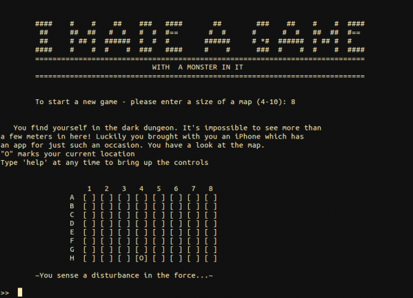
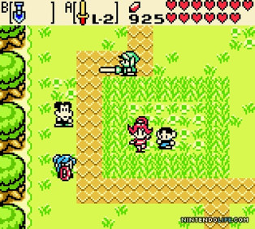
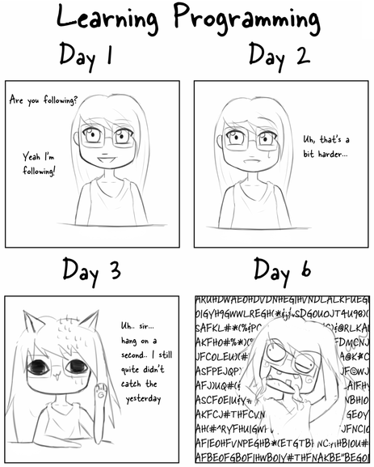
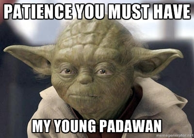

<!-- $theme: gaia -->
<!-- template: invert -->
<!-- $size: 16:9 -->

<style type="text/css">
html, body, div, p, slide, code { color:#f6f6f6; background: #222; }
</style>

# Initiation à la programmation et réalisation d'un jeu vidéo avec Python

### ==Atelier 1==


---

# ==Welcome !==

### Qui sommes-nous ?

- Alex & Nico
	- Collectif n×10⁹ (n-milliards)
	- Association HackStub

### Et vous ?

---

# Disclaimer

###### Volontairement ambitieux
###### Condensé de 20~40h de cours+TP à la fac
###### (_Ne partez pas en courant svp_ :smile:)
###### <br />
# 

---

# Objectifs

#### Initiation générale à la programmation
* Python

#### Réalisation d'un jeu vidéo
* Par vous-même ! (même si guidé·e·s)
* D'abord en texte uniquement (text-based)
* Puis en 2D avec Pygame (tile-based)

---

# Ayez confiance en vous

# 

---

# Trompez-vous

# 

---

## Interrompez-nous,
## posez-nous des questions !

---

# Fonctionnement des ateliers

#### Séance 1
- Au début, relativement marginal (alternance théorie/pratique)

#### Séance 2, 3, 4
- Support d'ateliers (memo + fiche d'étapes)

#### ==Nous aiderons en priorité les moins avancé·e·s !==

---

# Déroulé des 4 séances

##### Séance 1 - Les bases
##### 

---

# Déroulé des 4 séances

##### Séance 1 - Les bases
##### Séance 1 et 2 - Jeu *text-based*
##### 

---

# Déroulé des 4 séances

##### Séance 1 - Les bases
##### Séance 1 et 2 - Jeu *text-based*
##### Séance 3 - Utilisation de Pygame
##### 

---

# Déroulé des 4 séances

##### Séance 1 - Les bases
##### Séance 1 et 2 - Jeu *text-based*
##### Séance 3 - Utilisation de Pygame
##### Séance 3 et 4 - Jeu 2D, *tile-based*
##### 

---

# Aujourd'hui


#### - Principes de base de la programmation
#### - Exercices
- Premier programme, les variables
- les fonctions, les conditions
- les boucles, les listes, les dictionnaires ...
#### - Début d'un jeu « _text-based_ »

---

# Apprendre la programmation

# 


---

# Apprendre la programmation

#### Pas complètement facile,
#### mais pas inaccessible non plus !
#### 

---

# Programmer
## ==
# Écrire des recettes

---

# Écrire des recettes

### Comme en cuisine !

* Préparer **des outils** et **des ingrédients**
* Donner **des instructions**
* ... parfois en utilisant **des "fonctions"**
    * _« monter des oeufs en neige »_
    * _« cuire à thermostat 6 pendant 20 minutes »_

---

### Le cuisinier est stupide,
### Il faudra penser à tout !

##### -

#### Pour bien écrire la recette,
#### il faut s'imaginer être à sa place !

---

### Intérêt de l'apprentissage de la programmation

###### Devenir acteur dans l'utilisation de sa machine (et de l'informatique en général)
   - Avoir un sentiment de maîtrise de son outil
   - S'ouvrir au possibilités offertes par la création informatique

###### Retrouver un intérêt pour les maths :yum:
   - Utiles dans les jeux videos (e.g. la trigonométrie)
   - Concepts de progr. <-> concepts mathématiques

---

## Contextes de programmation

- **Décrire et programmer des pages web** (HTML / CSS / Javascript / PHP)
- **Génération procedurale d'image / son** (Processing, MaxMSP, Super Collider, SVG, ...)
- **Électronique** (Arduino, Assembleur / C / C++)
- **Rédiger et formater des documents** (LaTeX)
- **Administrer des serveurs** (ligne de commande)
- ==**Programmation généraliste**== (C++, Java, Python, ...)

---

## Différents langages et niveaux d'abstraction

Afficher « hello world! » ==en **Code machine**==
```
09 CD
21 30
E4 CD
16 B8
00 4C
CD 21 (he)
48 65 (ll)
6C 6C (o )
6F 20 (wo)
57 6F (rl)
72 6C (d!)
64    ($)
```

---

## Différents langages et niveaux d'abstraction

Afficher « hello world! » ==en **Assembleur**==
```asm
org 100h
mov dx, message
mov ah, 09h
int 21h

xor ah, ah
int 16h
mov ax, 4c00h
int 21h

message db "hello world!$"
```

---

## Différents langages et niveaux d'abstraction

Afficher « hello world! » ==en **C**==

```C
#include <stdio.h>

int main(void)
{
    printf("hello world\n");
    return 0;
}
```

---


Différents langages et niveaux d'abstraction
------------------------------------------

Afficher « hello world! » ==en **Python**==

```python
print("hello world!")
```

---

# Niveaux d'abstraction

##### ==Bas-niveau== : proche des petits détails techniques

* Meilleures performances
* Il faut tout faire à la main !
* Difficile à écrire, comprendre et débugger

##### ==Haut-niveau== : proche des concepts humains

* Lisible et concis, facile à comprendre et débugger
* Moins performant, moins généraliste (ex. HTML)

---

# La place de python

* **Généraliste mais simple** (~moyen-niveau :yum:)
* **Lisible !** (pas de superflu syntaxique)
* **Facile pour les débutants** (pas trop "pédant")
* **Très versatile** (peut être utilisé pour faire des scripts, du son, du web, du calcul scientifique, ...)

---

# Projets réalisés en Python

##### -
##### Atom
##### Blender
##### Dropbox
##### EVE Online
##### World of tanks
##### ...

---

## Apprendre de la programmation

##### ==Processus d'apprentissage similaire à n'importe quelle langue==

0. **Concepts** (mots, verbes, phrases ...)
1. **Grammaire et syntaxe**
2. **Vocabulaire**
3. **Organiser** sa rédaction et ses idées : **structurer** correctement son code et ses données

---

### Rester calme,
### patient·e, méthodique

### -

### 

---

### Découper les problèmes en plusieurs sous-tâches / étapes

##### Exemple : ==*Battre des oeufs en neige*==
- Préparer un saladier et un ramequin
- Prendre les oeufs
- Un par un, casser les oeufs au-dessus du saladier en séparant le blanc des jaunes
- Mettre les jaunes dans le ramequin
- Saler les blancs
- etc ...

---

### Ready, Steady,  Go !

# -

# 

---

# Check que tout le monde a
# Atom / Python / etc

---

## Exercice 0 : utiliser le terminal

Lister les fichiers dans le répertoire : `ls` (list)
```sh
ls -l
----------------------------------------------------------
-rw-r--r-- 1 alex alex  158 Nov  6 11:06 fichier1
-rw-r--r-- 1 alex alex  666 Nov  6 11:06 conquerir_le_monde
drw-r--r-- 1 alex alex 4096 Nov  6 11:06 super_dossier/
```

Changer de répertoire : `cd` (==c==hange ==d==irectory)

```sh
cd super_dossier
```

---

## Exercice 0 : utiliser le terminal

#### Aidez-vous de l'auto-completion, avec Tab !

#### 

---

## Exercice 0 : utiliser le terminal

Arréter une commande en cours (Ctrl+C, comme _Cancel_)

```
<Ctrl+C>
```

---

## Exercice 0 : utiliser le terminal

#### -
#### ACHTUNG !!!
#### ==Faites attention à ce que vous dit le terminal !!!==

---


## Exercice 1 : un premier programme

- ==Ecrire un programme et le lancer== *(sans trop comprendre ce qu'on fait, mais ça va venir :yum: !)*

###### Ouvrir un fichier et taper :

```python
print("Salut !")
print("Ça va ?")
print("Comment t'appelles-tu ?")
```

###### Enregistrer le fichier sous un nom comme `programme.py`.
###### Taper dans terminal :

```sh
python3 programme.py
```

---

## Exercice 1 : un premier programme

#### ==Que s'est-il passé ?==

# 

---

## Exercice 1 : un premier programme

#### ==Que s'est-il passé ?==

* Nous avons lancé un programme en python

* Les lignes ont été analysées et exécutée une par une, séquentiellement (langage interprété)

* La commande `print` permet d'afficher un message dans le terminal

---

## Exercice 2 : les variables

- ==Stocker et utiliser de l'information dans des variables==

###### Taper et lancer le programme suivant :

```python
message = "Je connais la réponse à la vie et l'univers !"
reponse = 6 * 7

print("Salut !")
print(message)
print(reponse)
```

---

## Exercice 2 : un premier programme

#### ==Que s'est-il passé ?==

* Nous avons stocké des informations dans des variables

* Nous avons réutilisé cette information plus tard

Une variable peut être vue comme **une case mémoire, un tiroir, un récipient** qui peut contenir **une (ou plusieurs) information(s)**. Il est possible d'**accéder et modifier à volonté** le contenu d'une variable.

---

## Exercice 3 : Interactivité

- ==Récupérer des informations données par l'utilisateur==

###### Taper et lancer le programme suivant :

```python
nom = input("Entrez un nom : ")
message = "-- Tut tut tut... Réveillez-vous " + nom + " !"

print(message)
```

---

## Exercice 3 : Interactivité

#### ==Que s'est-il passé ?==

* Nous avons demander à l'utilisateur de taper quelque chose

* Nous avons stocké ce qu'il a tapé dans une variale

* Nous avons réutilisé cette variable (_concatenation de chaîne de caractères_)

---

## Exercice 4 : Les fonctions

- ==Donner un nom à un ensemble d'instructions==

###### Taper et lancer le programme suivant :


```python
def demander_nom():
    reponse = input("Entrez un nom : ")
    return reponse


message = "-- Tut tut tut... Réveillez-vous " + demander_nom() + " !"

print(message)
```

---

## Exercice 4 : Les fonctions

#### ==Que s'est-il passé ?==

Nous avons créé une ==fonction==, nommée `demander_nom`.

* nous utilisons le mot clé **def**

* nous devons **indenter** chaque ligne qui est à l'intérieur de la fonction

* nous pouvons déclarer et utiliser **des variables qui n'existent que dans le contexte de la fonction** (« variables locales »)

* une fonction peut retourner une valeur en utilisant **return**

---

## Exercice 4 : Les fonctions

#### ==Quel intérêt==

Grace aux fonctions, nous pouvons :

* **éviter de répéter des suites d'instructions** que l'on utilise plusieurs fois (« _battre des oeufs en neige_ »)
* **donner un sens** à des suites d'instructions (par le nom qu'on lui donne)
* **structurer le code** en séparant un problème en plusieurs étapes (= fonctions)

---

### Variable locale & globale

```python
prenom = "alex"

def demanderUnNom() :
    nom = input("Entrez un nom :")
    return nom

print(prenom)
print(nom)
```

---

## Exercice 5 : Les conditions

Les structures conditionnelles permettent d'adapter le comportement d'un programme si une condition est vraie ou fausse.

#### Syntaxe en "pseudo-code" :

```python
SI(condition == True)
ALORS
   une_instruction()
   une_autre_instruction()
SINON
   encore_une_autre_instruction()

une_instruction_quoi_qu_il_arrive()
```

---

## Exercice 5 : Les conditions

Les structures conditionnelles permettent d'adapter le comportement d'un programme si une condition est vraie ou fausse.

#### Syntaxe en python

```python
condition = True

if(condition == True):
   print("La condition est vraie !")
else:
   print("La condition est fausse !")

print("Ce message s'affiche quoi qu'il arrive")
```

###### (Attention à l'indentation !)

---


## Exercice 5 : Les conditions

#### Ecrire des conditions

```python
# Egalité (par exemple d'une chaine de caractère)
if(variable == "plop"):

# Comparaison de valeur numérique
if(variable > 3.14):

# Negation
if not(variable > 3.14):

# Condition 1 ET condition 2
if(variable1 == "plop") and (variable2 > 3.14):

# Condition 1 OU condition 2
if(variable1 == "plop") or (variable2 > 3.14):
```

---

## Exercice 5 : Les conditions

# Attention à l'indentation !

# 

---

## Exercice 5 : Les conditions

Ajouter à la fonction `demander_nom()` : si le nom fait moins de 6 caractères, afficher un message, sinon affiche un autre message.

###### _(Vous pouvez utiliser `len(chaine)` pour connaître la longueur d'une chaîne de caractère)_

###### Rappel : syntaxe des conditions

```python
condition = True

if(condition == True):
   print("La condition est vraie !")
else:
   print("La condition est fausse !")

print("Ce message s'affiche quoi qu'il arrive")
```

---


### Exercice 6 : Arguments des fonctions

Une fonction peut prendre des arguments.

#### Syntaxe :

```python
def battre_des_oeufs_en_neige(nombre_oeuf):
	print("Il faut battre" + str(nombre_oeuf) + " en neige!")

battre_des_oeufs_en_neige(3)
battre_des_oeufs_en_neige(5)
```

`nombre_oeuf` se comporte comme une variable locale valant 3, puis 5.

#### Modifier la fonction `demander_nom()` pour que la taille du nom soit donnée en argument

---

### Exercice 7 : Les boucles `while`

- Les boucles permettent de répéter une série d'instructions.
- Les boucles `while` répètent des instructions tant qu'une condition est vraie

#### Syntaxe :

```python
une_variable = " "

while(une_variable != "une valeur"):
    premiere_instruction()
    deuxieme_instruction()
    troisieme_instruction()
```

---

### Exercice 7 : Les boucles `while`

#### Exemple :

```python
# Tant que je ne suis pas le meilleur dresseur
while(best_pokemon_trainer != "me"):
	# Capturer plus de pokemons
	capture_more_pokemon()
```

#### Définir une fonction `reveil_relou()` qui, en boucle :
- affiche "Tut tut tut"
- demande un mot de passe à l'utilisateur
#### tant qu'il n'a pas donné le bon mot de passe

---

### Exercice 8 : Les boucles `for`

- Les boucles `for` permettent de répéter des instructions un nombre donné de fois

```
for i in range(10):
    print(i*7)
```

#### Ajouter à la fonction un compteur qui s'incrémentera à chaque mauvais mot de passe, et une boucle `for` qui affichera autant de "Tut tut tut..." que le compteur.

---

### Exercice 9 : Les listes

Les listes permettent de stocker une série d'information dans une seule variable

```python
ma_liste = ["toto", "schpof", "shadok"]
autre_liste = [3.14, "hackstub", False, 42]
```

```python
# Accéder à la valeur d'un élément :
premier_element = ma_liste[0]
# Modifier un element
ma_liste[1] = "bidule"
# Ajouter un élément à la fin
ma_liste.append("truc")
```

---

### Exercice 9 : Les listes

Les boucles `for` permettent d'itérer facilement sur chacun des éléments d'une liste

```python
ma_liste = ["toto", "schpof", "shadok"]

for element in ma_liste:
    print(element)
```
```sh
toto
schpof
shadok
```

---

### Exercice 9 : Les listes

-

#### Déclarer dans le programme une liste contenant les pièces de la maison et l'afficher après que le réveil ait fini de sonner !

On peut prendre les pièces : chambre, cuisine et salle de bain


---

### Exercice 10 : Les dictionnaires

Les dictionnaires sont des structures similaire aux listes, mais indexées par des chaînes de caractères :

```
age = {
   "alice": 20,
   "bob": 18,
   "charlie": 23
}

print(age["charlie"])
```

```
23
```

---

### Exercice 10 : Les dictionnaires

```python
age = {
   "Alice": 20,
   "Bob": 18,
   "Charlie": 23
}

age["Charlie"] = 24
age["Dianne"] = 32
```
```python
for prenom in age:
   print(prenom + " a " + age[prenom] + " ans")
```
```text
Bob a 18 ans
Alice a 20 ans
Dianne a 32 ans
Charlie a 24 ans
```


---

### Exercice 10 : Les dictionnaires

#### Créer un dictionnaire avec l'état du personnage après son réveil
- propre, habillé·e, affamé·e, reveillé·e
- utiliser des booléens (`True`/`False`)

#### Faire une boucle qui affiche l'état du perso
