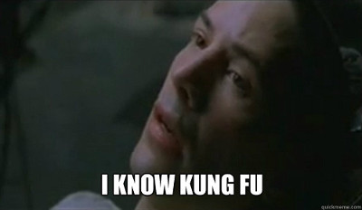

Initiation à la programmation et réalisation d'un jeu vidéo en Python
---------------------------------------------------------------------

### **Atelier 1**


Welcome ! 
========

### Qui sommes-nous ?

Alex A. + Nico C.

n×10⁹

hackstub

### Qui êtes-vous ?


Disclaimer
----------

* **Ambitieux** : condensé de 20~40h de cours+TP à la fac

* Vous êtes les **béta-testeurs** de cet atelier

* (_Ne partez pas en courant svp_ :D)


Objectifs
----------

**1. Initiation générale à la programmation**
* Python

**2. Réalisation d'un jeu vidéo**
* Par vous-même ! (même si guidé)
* Pygame


Ayez confiance en vous
----------------------


Trompez-vous
------------


### Interrompez-nous,
### posez-nous des questions ! 


Fonctionnement de l'atelier
---------------------------

* Alternance théorie / pratique (au moins le 1er jour)

* 7~10 participants = ~beaucoup pour 2
   * Support d'ateliers (memo + exos)
   * On aidera en priorité les moins avancés


Plan de l'atelier
-----------------

### Jour 1 - Les bases

* Principes de base de la programmation
* Utilisation de Python
* Afficher une fenêtre et dessiner avec Pygame




Plan de l'atelier
-----------------

### Jour 2 - Jeu vidéo minimal

* Utiliser des classes
* Notions de bases pour construire un jeu
* Afficher une carte
* Déplacer un personnage sur la carte


Plan de l'atelier
-----------------

### Jour 3 - Mécanique avancée

* Jeu type _transport puzzle_
* Interagir avec des objets
* Décrire et vérifier les conditions de victoire


Aujourd'hui (jour 1)
-----------


* Principes de base de la programmation
* Exercices
    1. premier programme, les variables
    2. les fonctions
    3. les conditions
    4. les listes et les boucles
* Débuts avec Pygame
    * Afficher une fenêtre
    * Dessiner des trucs et coller des images


Principes de base de la programmation
==================================


**Pas complètement facile,** 

**mais pas inaccessible non plus !**


Programmer
----------
== 
--
Écrire des recettes
-------------------


Écrire des recettes
-------------------

**Comme en cuisine !**

* Préparer **des outils** et **des ingrédients**
* Donner **des instructions**
* ... parfois en utilisant **des "fonctions"**
    * _« monter des oeufs en neige »_


**Le cuisinier est stupide,** 

**Il faudra penser à tout !**

Pour bien écrire la recette, 

il faut s'imaginer être à sa place ! 


Intérêt de l'apprentissage de la programmation
---------------------------------------------

* **Devenir acteur** dans l'utilisation de sa machine (et de l'informatique en général)
    * et donc avoir un sentiment de maîtrise de son outil
    * s'ouvrir au possibilités offertes par la création informatique

* **Retrouver un intérêt pour les maths** :)
    * Utiles dans les jeux videos (e.g. la trigonométrie)
    * Concepts de programmation <-> concepts mathématiques


Différents contextes de programmation
-----------------------------------

* **Décrire et programmer des pages web** (HTML / CSS / Javascript / PHP)
* **Generation procedurale d'image / son** (Processing, MaxMSP, Super Collider, SVG, ...)
* **Electronique** (Assembleur / C / C++)
* **Rédiger et mettre en forme des documents textes** (LaTeX)
* **Interagir avec un système d'exploitation** (ligne de commande / scripts bash)
* **Programmation generaliste** (C++, Java, Python, ...)


Différents langages et niveaux d'abstraction
------------------------------------------

Afficher « hello world! » en **Code machine**
```
BA 10 
01 B4 
09 CD 
21 30 
E4 CD 
16 B8 
00 4C 
CD 21 (he)
48 65 (ll)
6C 6C (o )
6F 20 (wo)
57 6F (rl)
72 6C (d!)
64    ($)
```


Différents langages et niveaux d'abstraction
------------------------------------------

Afficher « hello world! » en **Assembleur**
```
org 100h
mov dx, message
mov ah, 09h
int 21h

xor ah, ah
int 16h
mov ax, 4c00h
int 21h

message db "hello world!$"
```


Différents langages et niveaux d'abstraction
------------------------------------------

Afficher « hello world! » en **C**

```
#include <stdio.h>

int main(void)
{
    printf("hello world\n");
    return 0;
}
```


Différents langages et niveaux d'abstraction
------------------------------------------

Afficher « hello world! » en **Python**

```
print("hello world!")
```


Niveaux d'abstraction
----------------------

**Bas-niveau** 
= 
Proche des concepts de la machine

* On peut tout faire
* Meilleures performances
* Difficile à écrire, comprendre et débugger

**Haut-niveau** 
= 
Proche des concepts humains

* Lisible et concis, facile à comprendre et débugger
* Moins performant
* Moins généraliste

_(Vocabulaire valable aussi pour la discussion des concepts de jeux vidéos)_


La place de python
------------------

* **Généraliste mais simple** (moyen-niveau)
* **Lisible !** (pas de superflu syntaxique)
* **Facile pour les débutants** (pas trop "pédant")
* **Très Versatile** (peut être utilisé pour faire des scripts, du son, du web, du calcul scientifique, ...)


Projets réalisés en Python
-------------------------

* Atom
* Blender
* Dropbox
* EVE Online
* World of tanks


Apprentissage de la programmation
-----------------------------

Processus d'apprentissage similaire à n'importe quelle langue : 

0. **Concepts** (mots, utilisation, ...)
1. **Grammaire et syntaxe**
2. **Vocabulaire**
3. **Organiser / structurer** sa rédaction et ses idées => organiser correctement son code et ses structures de données


Rester calme, patient, méthodique
---------------------------------


Découper les problèmes
----------------------

### en plusieurs sous-tâches / étapes

Exemple : **Battre des oeufs en neige**
- Préparer un saladier et un ramequin
- Prendre les oeufs
- Un par un, casser les oeufs au-dessus du saladier en séparant le blanc des jaunes
- Mettre les jaunes dans le ramequin
- Saler les blancs
- ...


* séparer autant que possible la réflexion sur comment réaliser une tâche (algorithmie) ... et son écriture (syntaxe, grammaire, vocabulaire).


Ready Steady Go
===============


Check que tout le monde a Atom / Python / etc
---------------------------------------------


La ligne de commande
--------------------


Exercice 1 : un premier programme
------------------------------

#### Ecrire un programme et le lancer 
##### (sans trop comprendre ce qu'on fait mais ca va venir)

Ouvrir un fichier et taper

```python
nom = input("Entrez un nom : ")
message = "Bonjour " + nom + " !"

print(message)
```

Enregistrer le fichier sous un nom comme `programme.py`. Taper dans terminal : 

```sh
python programme.py
```


### Que s'est-il passé ?

* Nous avons lancé un programme en python

* Les lignes ont été analysées et exécutée une par une, séquentiellement (langage interprété)


### Que fait ce programme ?

```python
# Demander a l'utilisateur de taper quelque chose
# et stocker le résultat dans une variable 'nom'
nom = input("Entrez un nom : ")

# Concatener des chaines de caractères
# et stocker le résultat dans une variable 'message'
message = "Bonjour " + nom + " !"

# Afficher le contenu de message a l'écran
print(message)
```


### Premier concept fondamental : les variables

Une variable peut être vue 

comme **une case mémoire, un tiroir, un récipient** 

... qui peut contenir **une (ou plusieurs) information(s)**.

```python
a = 3.14
variable_super_cool = "Plop"
schpof = (1, 2, 3)
```


Exercice 2 : introduction des fonctions
------------------------------------

Ecrire et exécutez le programme suivant :
```python
def demanderUnNom() :
    nom = input("Entrez un nom :")
    return nom
    
print("Bonjour" + demanderUnNom() + "!")
```


```python
def demanderUnNom() :
    nom = input("Entrez un nom :")
    return nom
```

### Explications

Nous avons créé une fonction nommée **demanderUnNom**. Pour ce faire : 
* nous utilisons le mot clé **def**
* nous devons **indenter** chaque ligne qui est à l'intérieur de la fonction
* nous pouvons déclarer et utiliser **des variables qui n'existent que dans le contexte de la fonction** (« variables locales »)
* une fonction peut retourner une valeur en utilisant **return**


### Intérêt

Grace aux fonctions, nous pouvons
* **éviter de répéter des suites d'instructions** que l'on utilise plusieurs fois (« battre des oeufs en neige »)
* **donner un sens** à des suites d'instructions (par le nom qu'on lui donne)
* **structurer le code** en séparant un problème en plusieurs étapes (= fonctions)


### Variable locale & globale

```python
prenom = "alex"

def demanderUnNom() :
    nom = input("Entrez un nom :")
    return nom

print(prenom)
print(nom)
```


### Arguments d'une fonction

```python
def demanderUnNom(messageDeDemande) :
    nom = input(messageDeDemande)
    return nom

nom = demanderUnNom("Entrez un nom svp ! ")
print("Bonjour" + nom + "!")
```


In case of emergency
-------------------


Si vous ne savez plus ce que votre code fait, ou pour débugger, utilisez `print` pour afficher vos différentes variables pendant les étapes intermédiaires !


Exercice 3 : les conditions
-------------------------

* Les structures conditionnelles permettent d'adapter le comportement d'un programme si une condition est vraie ou fausse.

Exemple : option cochée ou non dans un programme


### La syntaxe en pseudo-code

```
SI (condition == True) ALORS
  une_instruction()
  ...
SINON
  une_autre_instruction()

une_instruction_quoi_qu_il_arrive()
```


### La syntaxe en python

```python
if (condition == True) : 
  print("La condition est vraie !")
  
else :
  print("La condition est fausse !")

print("Ce message s'affiche quoi qu'il arrive")
```

(attention à l'indentation !)


### Ecrire des conditions

```python
# Egalité (par exemple d'une chaine de caractère)
if (variable == "plop") :

# Comparaison de valeur numérique
if (variable > 3.14) :

# Negation de la precedente condition
if not (variable > 3.14) :

# Condition 1 ET condition 2
if (variable1 == "plop") and (variable2 > 3.14) :

# Condition 1 OU condition 2
if (variable1 == "plop") or (variable2 > 3.14) :
```


### Exercice 3

Modifier le programme précédent pour afficher un message différent suivant si un nom particulier est donné !


Exercice 4 et 5 : les listes et les boucles
-----------------------------------


### Les listes

Les listes permettent de contenir des séries d'éléments : 
```python
liste = [ "plop", 3.14, "stuff" ]

print(liste[0])
print(liste[1])
print(liste[2])

> plop
> 3.14
> stuff
```


### Les boucles `for`

Les boucles permettent d'exécuter facilement des actions pour chaque élément de listes.

En pseudo-code :

```python
POUR CHAQUE element DANS liste

    Afficher(element)
```


### Les boucles `for`

Les boucles permettent d'exécuter facilement des actions pour chaque élément de listes.

En Python :

```python
# Pour chaque element dans L
for element in liste :

    # Afficher l'element
    print(element)
```

(Comme pour les fonctions et les conditions, 

**attention à l'indentation !**)


Dans certains cas, il peut être utile de générer des listes de chiffres pour itérer de 0 à _n_ ...

```python
print(range(10))
> [0, 1, 2, 3, 4, 5, 6, 7, 8, 9, 10]
```


### Les boucles `while`

Un autre type de boucle existe et permet d'executer des actions tant qu'une condition est remplie.

```python
# Tant que je ne suis pas le meilleur dresseur
while (bestPokemonTrainer != me) :

    # Capturer plus de pokemons
    captureMorePokemon()
```


### Exercice 4 - mot de passe

Ecrire un programme qui demande un mot de passe jusqu'à ce que l'utilisateur donne le bon


### Exercice 5 - calcul de somme

Initialisez une liste de nombres, par exemple :

4, 8, 15, 16, 23, 42

Utilisez une boucle pour calculer la somme des nombres


### Exercice 6 - (Opt.) suite de Fibonnaci

Ecrire un programme qui calcule la suite de Fibonnaci jusqu'au rang 100 : 
0, 1, 1, 2, 3, 5, 8, 13, 21, ...

* Chaque terme est la somme des deux précédents
   * f(n) = f(n-2) + f(n-1)
* Vous pouvez utiliser `liste.append(valeur)` pour ajouter une valeur à la fin d'une liste


Résumé
------

En programmation, on utilise : 
* **des variables**, qui sont des cases mémoires pour stocker des informations
* **des fonctions**, qui sont des listes d'instructions avec un nom
* **des conditions**, pour executer des instructions selon les situations
* **des listes**, pour stocker des séries d'information ensemble
* **des boucles**, pour répéter des actions sur différents éléments ou en fonction d'une condition


Introduction à Pygame
=====================


Les librairies
--------------

Un ensemble de fonctions déjà pensées, écrites et packagées, qui servent un but particulier. Dans le cas de Pygame : écrire des jeux vidéos.

On importe les fonctions en utilisant :
```python
import someLibrary
```


Ce que permet Pygame
-------------------

* Afficher une fenêtre
* Dessiner des formes (lignes, rectangles, ...)
* Importer et afficher des images à des positions données
* Détecter les touches de clavier
* Détecter des collisions entre des objets
* ...


Premier programme avec Pygame
-----------------------------

```python
import pygame, sys
from pygame.locals import *

# Initialiser pygame
pygame.init()

# Initialiser une fenêtre / l’écran de jeu
ecran = pygame.display.set_mode((400, 300))
pygame.display.set_caption('Mon jeu!')

# Boucle principale
while True:

    # Verifier si il y a des événement en attente
    for event in pygame.event.get():

        # Si l'utilisateur a déclenché la fermeture de la fenêtre
        if event.type == QUIT:
            # Désinitialiser pygame
            pygame.quit()
            # Sortir du programme
            sys.exit()
```


Changer la couleur de fond
--------------------------

En utilisant :
```python
    couleur = (0,0,255)
    ecran.fill(couleur)
```

Modification du programme :

```python
# [...]

# Boucle principale
while True:

    # Remplir l'écran avec une couleur
    ecran.fill((0,0,255))

    for event in pygame.event.get():
        # [...]
    
    # Rafraîchir l'écran
    pygame.display.update()
```


Les surfaces
------------

#### Charger une image
```python
monImage = pygame.image.load("chaton.jpg").convert_alpha()
```

#### **Blitter** : Coller une surface sur une auret
```python
surfaceDArrivee.blit(surface, (x,y))
```


Charger et utiliser des images
------------------------------

```python
# Charger des images
fond = pygame.image.load("fond.png").convert()
image = pygame.image.load("image.png").convert_alpha()

# Boucle principale
while True:

    for event ...
    #[...]

    # Coller l'image de fond
    ecran.blit(fond, (0,0))

    # Coller l'autre image
    ecran.blit(image, (50,50))

    # [...]
```


Les événements
--------------

Des événements sont générés en fonction des appuis des touches et des
mouvements / clics de la souris.

Par exemple, bouger la souris génère un événement `MOUSEMOTION`.


Déplacer une image avec la souris
---------------------------------

```python
# [...]

# Définir la position initiale de l'image
image_x = 20
image_y = 20

# Boucle principale
while True:

    # Verifier si il y a des événement en attente
    for event in pygame.event.get():

        if event.type == QUIT:
            # [...]

        # Si l'utilisateur déplace la souris
        if event.type == MOUSEMOTION:
            # Change la position de l'image en stockant dans les variables
            # la position de la souris récupérée par event.pos x et y
            image_x = event.pos[0]
            image_y = event.pos[1]
    
    # [...]

    # Dessiner l'image à une certaine position
    # (qui change suivant la position de la souris)
    ecran.blit(image, (image_x,image_y))
```


