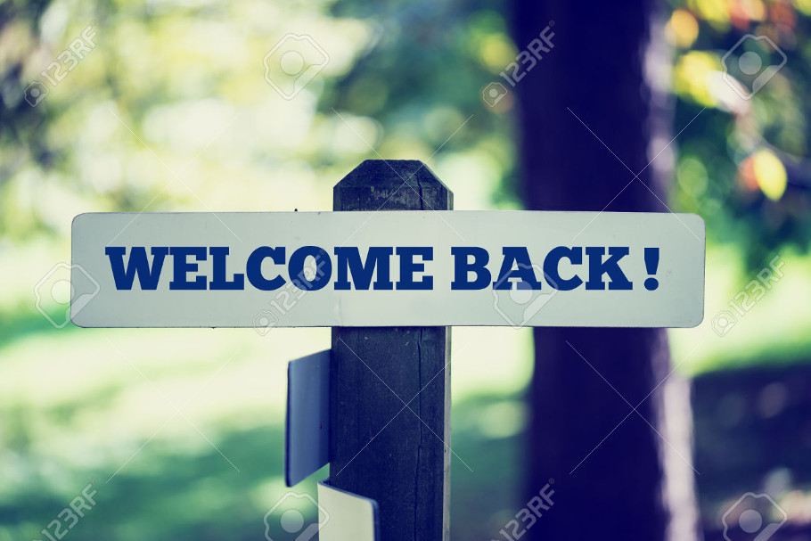
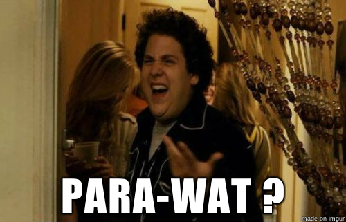
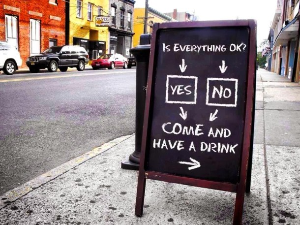
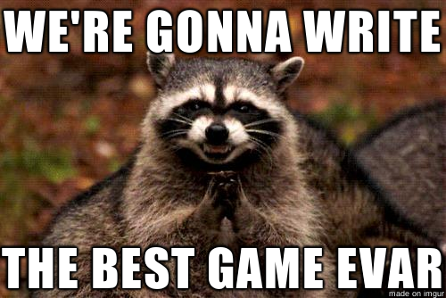

<!-- $theme: gaia -->
<!-- template: invert -->
<!-- $size: 16:9 -->

<style type="text/css">
html, body, div, p, slide, code { color:#f6f6f6; background: #222; }
</style>

# Initiation à la programmation et réalisation d'un jeu vidéo avec Python

### ==Atelier 2==


---

# 

---

# 

---


# Résumé : paradigme impératif de la programmation

# 

---

# Résumé : paradigme impératif

```python
--premiereInstruction--
--deuxiemeInstruction--
--troisiemeInstruction--
...
```
En programmation, on parle à une machine
- **phrases** ↔ ==**instructions**==
- **noms** ↔ ==**variables**==
- **verbes** ↔ ==**fonctions**==, ==**opérateurs**== (`=`, `*`, `+`...)
- **conjonctions** ↔ ==**mot clés**== (`if`, `else`, `or`, `and`, ...)
- (**pronoms** ↔ ==**syntaxe des classes**== (c.f. atelier 3))


---

# Résumé : les variables

Les ==**variables**== sont des tiroirs avec un nom, qui stockent de l'information
```python
# Changer le contenu d'une variable
# (N.B : la variable est créée automatiquement si elle n'existe pas !)
toto = 3.14
ploup = 42

# Affiche le contenu d'une variable et son type
print(toto)
print(type(toto))

# Operation entre variables (ici, multiplication)
watdafaq = toto * ploup
watdafaq = watdafaq * 2
```

---

# Résumé : les fonctions

Les ==**fonctions**== sont des séries d'instructions avec un nom

```
def demanderUnNom(taille) :
    print("Entre un nom d'au moins "+str(taille)+" characteres stp !")
    nom = input("Ton nom ?")
    return nom
```

- ==**L'indentation**== défini les instructions qui sont dans la fonction
- ==**Les arguments**== permettent de changer le comportement
- Les variables créées dans la fonction sont  ==**locales**==
- On peut sortir de la fonction et ==retourner une valeur== avec `return`


---

# Résumé : les conditions

Les ==**conditions**== permettent d'adapter les instructions à éxecuter suivant les situations

```
if (nom == "Alex") :
    print("Oh, je ne savais pas que c'était toi !")
else :
    print("Qui est-tu, et que fais-tu sur cet ordinateur !?!?")
```

- ==**L'indentation**== défini les instructions qui sont dans les blocs `if`/`else`
- Une condition se construit avec des ==**opérateurs**== (égalité `==`, différence `!=`, supérieur ou égal à `>=`, ...)


---


# 

---

# Aujourd'hui

- Exercices 7-10 (boucles, listes, dictionnaires)
- Travail sur le ==**jeu *text-based***==
- Découverte de ==**Pygame**==



---

# A propos des exos qui suivent

- Ils préparent le jeu text-based

- Un personnage qui se lève le matin et est harcelé par une IA qui refuse de le laisser sortir dehors tant qu'il n'est pas propre, habillé et rassasié !


---

### Exercice 7 : Les boucles `while`

- Les boucles permettent de répéter une série d'instructions.
- Les boucles `while` répètent des instructions tant qu'une condition est vraie

#### Syntaxe :

```python
une_variable = " "

while(une_variable != "une valeur"):
    premiere_instruction()
    deuxieme_instruction()
    troisieme_instruction()
```

---

### Exercice 7 : Les boucles `while`

#### Exemple :

```python
# Tant que je ne suis pas le meilleur dresseur
while(best_pokemon_trainer != "me"):
	# Capturer plus de pokemons
	capture_more_pokemon()
```

#### Définir une fonction `reveil_relou()` qui, en boucle :
- affiche "Tut tut tut"
- demande un mot de passe à l'utilisateur
#### tant qu'il n'a pas donné le bon mot de passe

---

### Exercice 8 : Les boucles `for`

- Les boucles `for` permettent de répéter des instructions un nombre donné de fois

```
for i in range(10):
    print(i*7)
```

#### Ajouter à la fonction un compteur qui s'incrémentera à chaque mauvais mot de passe, et une boucle `for` qui affichera autant de "Tut tut tut..." que le compteur.

---

### Exercice 9 : Les listes

Les listes permettent de stocker une série d'information dans une seule variable

```python
ma_liste = ["toto", "schpof", "shadok"]
autre_liste = [3.14, "hackstub", False, 42]
```

```python
# Accéder à la valeur d'un élément :
premier_element = ma_liste[0]
# Modifier un element
ma_liste[1] = "bidule"
# Ajouter un élément à la fin
ma_liste.append("truc")
```

---

### Exercice 9 : Les listes

Les boucles `for` permettent d'itérer facilement sur chacun des éléments d'une liste

```python
ma_liste = ["toto", "schpof", "shadok"]

for element in ma_liste:
    print(element)
```
```sh
toto
schpof
shadok
```

---

### Exercice 9 : Les listes


#### Déclarer dans le programme une liste contenant les pièces de la maison et l'afficher après que le réveil ait fini de sonner !

On peut prendre les pièces : chambre, cuisine et salle de bain


---

### Exercice 10 : Les dictionnaires

Les dictionnaires sont des structures similaire aux listes, mais indexées par des chaînes de caractères :

```
age = {
   "alice": 20,
   "bob": 18,
   "charlie": 23
}

print(age["charlie"])
```

```
23
```

---

### Exercice 10 : Les dictionnaires

```python
age = {
   "Alice": 20,
   "Bob": 18,
   "Charlie": 23
}

age["Charlie"] = 24
age["Dianne"] = 32
```
```python
for prenom in age:
   print(prenom + " a " + age[prenom] + " ans")
```
```text
Bob a 18 ans
Alice a 20 ans
Dianne a 32 ans
Charlie a 24 ans
```


---

### Exercice 10 : Les dictionnaires

#### Créer un dictionnaire avec l'état du personnage après son réveil
- propre, habillé·e, affamé·e, reveillé·e
- utiliser des booléens (`True`/`False`)

#### Faire une boucle qui affiche l'état du perso


---

# Jeu text-based

---

# Introduction à Pygame

---

# Les librairies


Un ensemble de fonctions déjà pensées, écrites et packagées, qui servent un but particulier. Dans le cas de Pygame : écrire des jeux vidéos.

On importe les fonctions en utilisant :
```python
import someLibrary
```

---

Ce que permet Pygame
-------------------

* Afficher une fenêtre
* Dessiner des formes (lignes, rectangles, ...)
* Importer et afficher des images à des positions données
* Détecter les touches de clavier
* Détecter des collisions entre des objets
* ...

---

Premier programme avec Pygame
-----------------------------

```python
import pygame, sys
from pygame.locals import *
```

---

```
# Initialiser pygame
pygame.init()

# Initialiser une fenêtre / l’écran de jeu
ecran = pygame.display.set_mode((400, 300))
pygame.display.set_caption('Mon jeu!')

# Boucle principale
while True:

    # Verifier si il y a des événement en attente
    for event in pygame.event.get():

        # Si l'utilisateur a déclenché la fermeture de la fenêtre
        if event.type == QUIT:
            # Désinitialiser pygame
            pygame.quit()
            # Sortir du programme
            sys.exit()
```

---

Changer la couleur de fond
--------------------------

En utilisant :
```python
couleur = (0,0,255)
ecran.fill(couleur)
```

Modification du programme :

```python
# Boucle principale
while True:

    # Remplir l'écran avec une couleur
    ecran.fill((0,0,255))

    for event in pygame.event.get():
    
    # Rafraîchir l'écran
    pygame.display.update()
```

---

Les surfaces
------------

#### Charger une image
```python
monImage = pygame.image.load("chaton.jpg").convert_alpha()
```

#### **Blitter** : Coller une surface sur une auret
```python
surfaceDArrivee.blit(surface, (x,y))
```

---

Charger et utiliser des images
------------------------------

```python
# Charger des images
fond = pygame.image.load("fond.png").convert()
image = pygame.image.load("image.png").convert_alpha()

# Boucle principale
while True:

    for event ...
    #[...]

    # Coller l'image de fond
    ecran.blit(fond, (0,0))

    # Coller l'autre image
    ecran.blit(image, (50,50))

    # [...]
```
---


Les événements
--------------

Des événements sont générés en fonction des appuis des touches et des
mouvements / clics de la souris.

Par exemple, bouger la souris génère un événement `MOUSEMOTION`.

---


Déplacer une image avec la souris
---------------------------------

```python
# [...]

# Définir la position initiale de l'image
image_x = 20
image_y = 20

# Boucle principale
while True:

    # Verifier si il y a des événement en attente
    for event in pygame.event.get():

        if event.type == QUIT:
            # [...]

        # Si l'utilisateur déplace la souris
        if event.type == MOUSEMOTION:
            # Change la position de l'image en stockant dans les variables
            # la position de la souris récupérée par event.pos x et y
            image_x = event.pos[0]
            image_y = event.pos[1]
    
    # [...]

    # Dessiner l'image à une certaine position
    # (qui change suivant la position de la souris)
    ecran.blit(image, (image_x,image_y))
```


