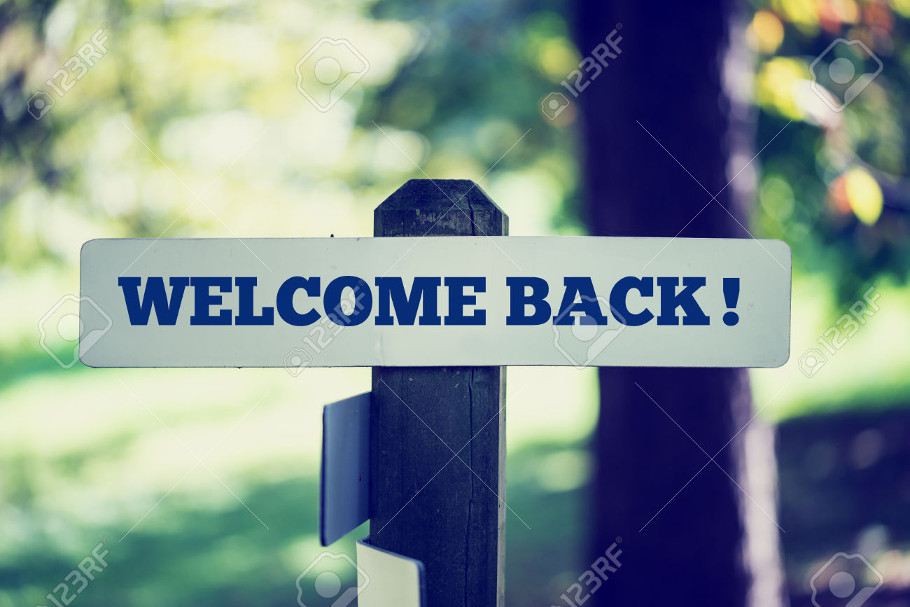
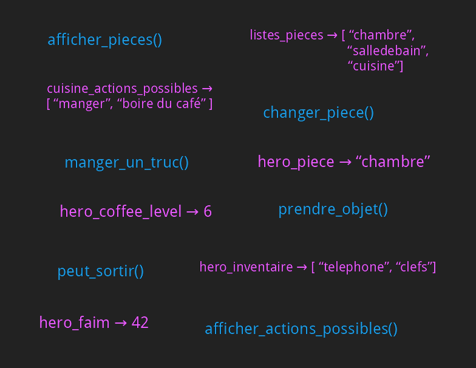
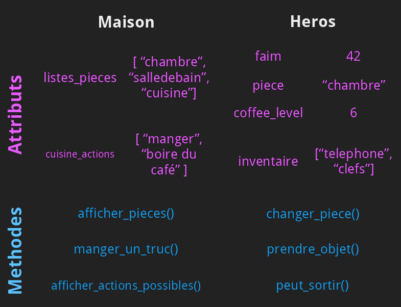

<!-- $theme: gaia -->
<!-- template: invert -->
<!-- $size: 16:9 -->

<style type="text/css">
html, body, div, p, slide, code { color:#f6f6f6; background: #222; }
</style>

# Initiation à la programmation et réalisation d'un jeu vidéo avec Python

### ==Atelier 3==


---

# 

---

# 

---


* **Des variables** : des cases mémoires pour stocker des informations
```
toto = 3.14
```
* **Des fonctions** : des séries d'instructions avec un nom
```
def demanderUnNom(message) :
    return input(message)
```
* **Des conditions** : executer des instructions selon les situations
```
if (nom == "Alex") :
    print("Oh, je ne savais pas que c'était toi !")
```

---

* **Des listes**, pour stocker des séries d'information ensemble
```
bons_legumes = [ "patates", "tomates", "poivrons" ]
```

* **Des dictionnaires**, pour stocker des séries d'information ensemble
```
age = { "alice" : 22, "bob" : 31, "charlie" : 26 }
```

* **Des boucles**, pour répéter des actions sur différents éléments ou en fonction d'une condition
```s
for legume in bons_legumes :
    print("Les "+legume+" c'est bon !")
```

---

# Les classes

---


# 

---


# 


---

# Les classes : principe

Les classes peuvent être vues comme des structures comprenant :
- des **variables** (nommées **attributs**) décrivant l'état d'un objet
- des **fonctions** (nommées **méthodes**) décrivant le comportement d'un objet et les possibilités d'interaction avec lui

---

# Les classes : exemple


---

# Les classes : vocabulaire


- On apelle **==classe==** la *description générale* des attributs et des méthodes, 

- Les  **==objets==** des *instances* de cette classe.

- Il s'agit de la même différences qu'entre « *==les voitures==* » (en général) et « *==ma voiture==* » (en particulier).


---

## Les classes : declaration

```python
class Monstre() :

    # "Constructeur" - le machin qui initialise un objet
    def __init__(self, type) :
        self.type   = type
        
        if (type == "Troll") :
            self.hp = 50
            self.force = 6
        elif (type == "Gobelin") :
            self.hp = 10
            self.force = 2
        else : print("Type de monstre inconnu !")
    
    def attaquer(self, cible) :

        cible.hp -= self.force
```

---

## Les classes : utilisation

```
# Preparer un troll
super_troll = Monstre("Troll")

print("Super Troll a " + super_troll.hp + " hp !")
```

---

## Les classes : utilisation

```
# Preparer un troll
super_troll = Monstre("Troll")

print("Super Troll a " + super_troll.hp + " hp !")

# Preparer une armee de gobelin
armee_gobelins = []
for i in range(4) :
   nouveau_gobelin = Monstre("Gobelin")
   armee_gobelins.append(nouveau_gobelin)
```

---

## Les classes : utilisation

```
# Preparer un troll
super_troll = Monstre("Troll")

print("Super Troll a " + super_troll.hp + " hp !")

# Preparer une armee de gobelin
armee_gobelins = []
for i in range(4) :
   nouveau_gobelin = Monstre("Gobelin")
   armee_gobelins.append(nouveau_gobelin)
   
# Faire une bataille !
super_troll.attaquer(armee_gobelins[2])
for gobelin in armee_gobelins :
    gobelin.attaquer(super_troll)
    
print("Super Troll a " + super_troll.hp + " hp !")
```

---


# Introduction à Pygame

---

# Les librairies


Un ensemble de fonctions déjà pensées, écrites et packagées, qui servent un but particulier. Dans le cas de Pygame : écrire des jeux vidéos.

On importe les fonctions en utilisant :
```python
import someLibrary
```

---

Ce que permet Pygame
-------------------

* Afficher une fenêtre
* Dessiner des formes (lignes, rectangles, ...)
* Importer et afficher des images à des positions données
* Détecter les touches de clavier
* Détecter des collisions entre des objets
* ...

---

Premier programme avec Pygame
-----------------------------

```python
import pygame, sys
from pygame.locals import *
```

---

```
# Initialiser pygame
pygame.init()

# Initialiser une fenêtre / l’écran de jeu
ecran = pygame.display.set_mode((400, 300))
pygame.display.set_caption('Mon jeu!')

# Boucle principale
while True:

    # Verifier si il y a des événement en attente
    for event in pygame.event.get():

        # Si l'utilisateur a déclenché la fermeture de la fenêtre
        if event.type == QUIT:
            # Désinitialiser pygame
            pygame.quit()
            # Sortir du programme
            sys.exit()
```

---

Changer la couleur de fond
--------------------------

Modification du programme (couleur = `(0,0,255)`)

```python
[...]

# Boucle principale
while True:

    # Remplir l'écran avec une couleur
    ecran.fill((0,0,255))

    for event in pygame.event.get():
        [...]
        
    # Rafraîchir l'écran
    pygame.display.update()
```

---

# Les surfaces


#### Charger une image
```python
monImage = pygame.image.load("chaton.jpg").convert_alpha()
```

#### **Blitter** : Coller une surface sur une autre
```python
surfaceDArrivee.blit(surface, (x,y))
```

---

Charger et utiliser des images
------------------------------

```python
# Charger des images
fond = pygame.image.load("fond.png").convert()
image = pygame.image.load("image.png").convert_alpha()

# Boucle principale
while True:

    for event ...
        # [...]

    # Coller l'image de fond
    ecran.blit(fond, (0,0))

    # Coller l'autre image
    ecran.blit(image, (50,50))

    # [...]
```
---


Les événements
--------------

Des événements sont générés en fonction des appuis des touches et des
mouvements / clics de la souris.

Par exemple, bouger la souris génère un événement `MOUSEMOTION`.

---


Déplacer une image avec le clavier
---------------------------------

```python
# Définir la position initiale de l'image
image_x = 20
image_y = 20

# Boucle principale
while True:

    # Verifier si il y a des événement en attente
    for event in pygame.event.get():

        if (event.type == pygame.KEYDOWN) :
            if (event.key == pygame.K_LEFT) :
                image_x -= 2
            if (event.key == pygame.K_RIGHT) :
                image_x += 2

    ecran.blit(image, (image_x,image_y))
```

---


# Construction d'un jeu tile-based

---


Elements de game building / design
----------------------------------

* **Afficher des choses** (écran, images, animations, texte)
* **Gérer les entrées** (clavier, souris, ...)
* Jouer des sons, de la musique
* **Penser l'architecture logicielle du jeu** (structures de données)
* **Penser la mécanique du jeu** (gameplay)
* Penser l'univers du jeu

Ref : http://lanyrd.com/2012/pycon/spbxc/

---

## Jeux tile-based

# 

---

## Jeux tile-based

# 

---

# Format de la map

# 

---

# Sprites

# 

---

# Les grandes étapes

### Le héros

1. Charger le sprite en mémoire
2. Afficher le héros sur l'écran
3. Ajouter une méthode `look` pour faire regarder le héros à
   droite/gauche/haut/bas
4. Ajouter une méthode `move` qui déplace le héros d'une case
5. Mapper les touches du clavier sur `look` et `move`

---

# Les grandes étapes

### La map

1. Lire le fichier ascii de la map vers une liste
2. Afficher la map

### Les collisions

1. Vérifier dans `move` si la case de destination est libre


